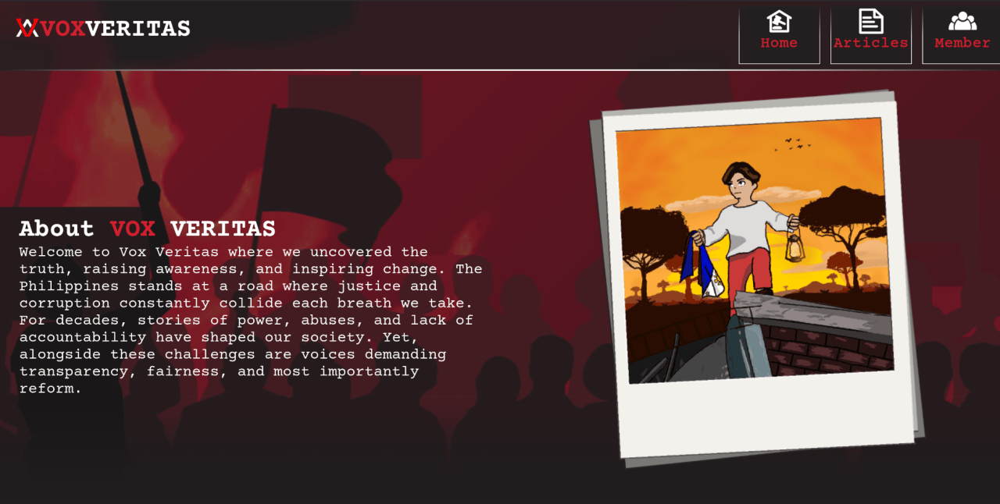
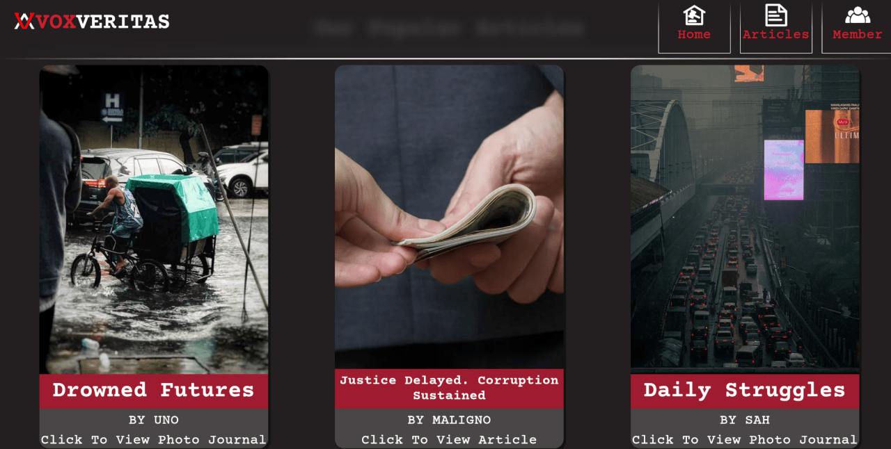
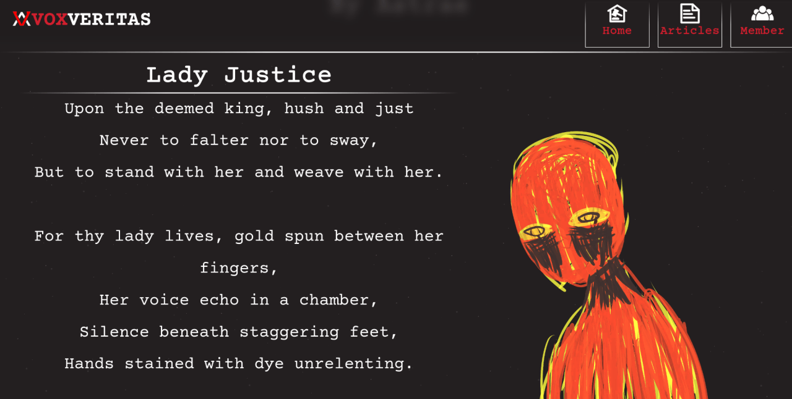

> [!NOTE]
> This project is already done. <ins>**The pages will be unpublished soon**</ins>. You can download this repo and run index.html locally if you still want to view the website

# Journalism Website Project

## About

A journalism like static website needed for a college project. Probably one of my more messier and larger projects.

Some general info on the code and projects

- [articles/](articles/). All the articles found in the homepage.
- [resources/](resources/). All resources used in the website.
- [scripts/](script/). Common scripts used throughout the website.
- [index.html](index.html). The homepage for the website.
- [styles/](styles/). Common styles used throughout the website.

# License

There are resources used in this project that have their own licenses, Mainly in `/resources`. And honestly
many of the codes that had been used here is from the usual internet searching on how things works.

But the code that being all javascript in `script/`, All css in `styles/` and all the html files in root and in `articles/` with the exception of `articles/tio-luntiangalon-article` are all licensed as CC-BY-SA. Read the LICENSE.txt
